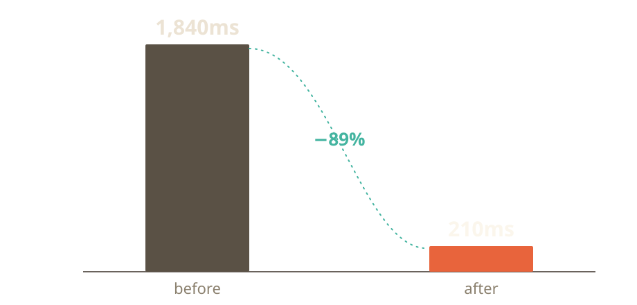

<!-- .slide: class="talk-title" -->

<p class="kicker">SampleConf 2026 · 18 min</p>

# Make the machine boring

<p class="byline">Your Name — @handle</p>

Note:
Open on the lens, not the slide. First line by heart: the night the "smart"
deploy script paged me at 3:11am. Hold a beat before advancing.

---

<!-- .slide: class="talk-statement" -->

The cleverest system in the room is usually the one on fire.

Note:
This is the throughline, stated as a shift. Say it slowly. Let it sit.

---

<!-- .slide: class="talk-section" -->

<p class="num">01</p>

## What "clever" cost us

---

Three real incidents, one root cause:

- A retry loop that "self-healed" — into a thundering herd <!-- .element: class="fragment" -->
- A cache that was smarter than its invalidation <!-- .element: class="fragment" -->
- An autoscaler chasing a metric that lagged reality by 90s <!-- .element: class="fragment" -->

Note:
One concrete particular each — name the service, the date, the blast radius.
Reveal one at a time so the room stays with you.

---

<!-- .slide: class="talk-data" -->

## p99 dropped from 1,840ms to 210ms the week we deleted the cleverness

<div class="chart">
  <!-- Replace with a real chart (SVG/PNG). One message per chart; label it directly. -->
  
</div>

Note:
Don't read the number off the slide — tell the story the number is evidence for.

---

The fix that worked:

```python [5]
# before: an "adaptive" backoff nobody could reason about
delay = base * (2 ** attempt) * jitter() * load_factor(metrics.now())

# after: boring, bounded, obvious
delay = min(MAX_DELAY, base * 2 ** attempt) + random_jitter()
```

Note:
Walk the diff. The point isn't the code — it's that you can hold the second
version in your head. Pause on "hold it in your head."
For LIVE presenting you can step the highlight with [1-2|4-5]; collapse it to a
single range like [5] before exporting the PDF (stepped reveals stack on one
printed page).

---

<!-- .slide: class="talk-quote" -->

> Make it work, make it right, make it boring.

<p class="attrib">— a senior engineer, after the postmortem</p>

---

<!-- .slide: class="talk-2col" -->

## Two questions before you add a clever bit

<div class="cols">
<div>

**Can the on-call reason about it at 3am?**

If the explanation needs a diagram, it needs a simpler design.

</div>
<div>

**What happens when it's wrong?**

Cleverness fails in ways you didn't model. Boring fails how you expect.

</div>
</div>

---

<!-- .slide: class="talk-statement" -->

Boring is a feature you ship for the human at 3am — and that human is you.

Note:
Callback to the opening page. Land it, pause, then the one ask.

---

<!-- .slide: class="talk-title" -->

## One ask

Pick your most "clever" component. Write down what happens when it's wrong.

<p class="byline">Slides &amp; notes: github.com/you/make-it-boring</p>

Note:
The single, specific call to action. Stop talking. Let them clap.
